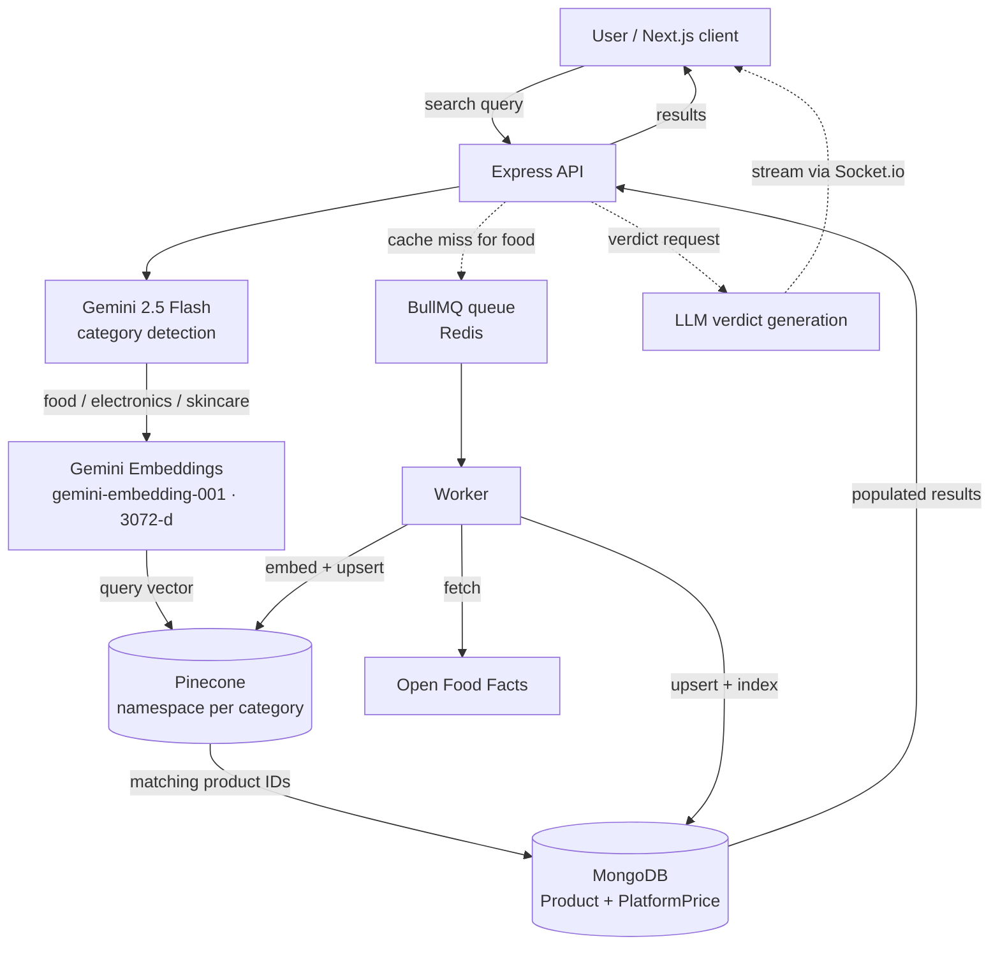

<div align="center">

# 🛒 ShopSense

### AI-powered product comparison & shopping assistant

Semantic product search, cross-platform price comparison, and personalized AI verdicts, built on a RAG pipeline.


[Demo](#-demo) · [Architecture](#-architecture) · [Engineering Notes](#-engineering-notes) · [Getting Started](#-getting-started) · [Roadmap](#-roadmap)

</div>

---

## 📌 Overview

Comparing products online means opening a dozen tabs, decoding spec sheets, and guessing which option actually fits *you*. **ShopSense** collapses that into one flow:

1. **Search in plain language.** "Serum for oily skin with niacinamide" works as well as an exact product name.
2. **Compare prices** across platforms, with freshness tracking.
3. **Get a personalized AI verdict** based on your own profile (skin type, health goals, tech use case).

Under the hood, ShopSense uses **Retrieval-Augmented Generation (RAG)**: an LLM classifies intent, embeddings power semantic retrieval from a vector database, and structured data is joined from MongoDB, so answers are grounded in real product data instead of hallucinated.

> **Status:** Backend core (auth, onboarding, ingestion, RAG search) is complete and tested. AI verdicts, real-time streaming, and the frontend integration are in active development. See the [Roadmap](#-roadmap).

---

## 🎬 Demo

<!-- Replace with a GIF/screenshot of your Postman flow or frontend once ready -->
| Semantic search | Price comparison | AI verdict |
|:---:|:---:|:---:|
| `docs/search.gif` | `docs/compare.png` | `docs/verdict.png` |

**What semantic search looks like in practice:** searching *"niacinamide serum"* also surfaces a salicylic acid serum and a moisturizer, related products that a keyword search would never return.

---

## ✨ Features

| Feature | Description | Status |
|---|---|:---:|
| 🔐 **Authentication** | JWT auth with dual-identifier login (email *or* phone), protected routes via middleware | ✅ |
| 👤 **Personalization profile** | Onboarding & preferences (health goals, skin type, tech use case) with partial updates | ✅ |
| 🧠 **Smart category detection** | Gemini classifies each query into `food`, `electronics`, or `skincare` | ✅ |
| 🔎 **Semantic search (RAG)** | Query embedding → Pinecone vector search → MongoDB hydration with per-platform prices | ✅ |
| 📥 **Background data ingestion** | BullMQ workers pull and cache Open Food Facts data on first search | ✅ |
| 💸 **Multi-platform pricing** | Per-platform price records with discount computation and staleness detection | ✅ |
| ⚖️ **AI verdicts** | Personalized "should you buy this?" verdicts, cached per user-product pair | 🚧 |
| ⚡ **Real-time streaming** | Verdict tokens streamed to the UI over Socket.io | 🚧 |
| 🖥️ **Frontend** | Next.js 14 App Router UI with charts and live updates | 🚧 |

---

## 🏗 Architecture



*Solid lines are implemented; dotted lines are in progress.*

### Search pipeline, step by step

1. **Intent:** `gemini-2.5-flash` maps the free-text query to one of three product categories.
2. **Embed:** the query is embedded with `gemini-embedding-001` using the `RETRIEVAL_QUERY` task type (products are embedded with `RETRIEVAL_DOCUMENT`).
3. **Retrieve:** Pinecone runs a cosine-similarity search inside that category's namespace.
4. **Hydrate:** matching products are loaded from MongoDB, with per-platform prices attached through a Mongoose virtual populate.
5. **Respond:** ranked results are returned with price, discount, and freshness data.

---

## 🧰 Tech Stack

**Frontend:** Next.js 14 (App Router) · Tailwind CSS · shadcn/ui · TanStack Query · Zustand · Socket.io client · Recharts

**Backend:** Node.js · Express 4 · MongoDB + Mongoose 8 · Socket.io · BullMQ · Redis (Docker) · JWT

**AI / Data:** Google Gemini (classification + embeddings) · OpenAI GPT-4o · Pinecone (serverless, AWS `us-east-1`) · LangChain.js · Open Food Facts API

---

## 🗄 Data Model

Twelve Mongoose models, all covered by an automated model test script:

`User` · `Product` · `PlatformPrice` · `PriceHistory` · `SearchHistory` · `Wishlist` · `PriceAlert` · `AffiliateClick` · `Verdict` · `CompareSession` · `Subscription` · `SystemLog`

Notable design choices:

- **`Product.specs` is a dynamic Mongoose `Map`**, so new categories can be added without schema migrations.
- **`PlatformPrice` is a separate collection** with a unique compound index on `{productId, platform}`. Upserts are idempotent, and one product can carry prices from many platforms. An `isStale` virtual flags prices older than 4 hours.
- **`Verdict` caches per user-product pair with a 7-day TTL** and stores a snapshot of the preferences it was generated for.
- **`Subscription` auto-computes `expiresAt`** with a `pre("validate")` hook.

---

## 🔬 Engineering Notes

Real problems hit while building the RAG pipeline, and how they were solved:

<details>
<summary><b>1. Embedding model deprecation and migration</b></summary>

`embedding-001` was deprecated, and `text-embedding-004` turned out not to exist for the project's API key. Instead of guessing, I wrote a `listModels` REST diagnostic script to see what was actually available, then migrated to `gemini-embedding-001` (3072-d native output) and recreated the Pinecone index at the matching dimension.
</details>

<details>
<summary><b>2. LLM "thinking" tokens silently eating the output budget</b></summary>

`gemini-2.5-flash` returned empty responses with `finishReason: MAX_TOKENS`. Its internal reasoning tokens were consuming the entire `maxOutputTokens` budget. The pinned SDK doesn't expose `thinkingConfig`, so I raised the token budget, verified the fix, and documented the cause.
</details>

<details>
<summary><b>3. A misleading Pinecone error</b></summary>

"Must pass in at least 1 record to upsert" looked like an empty-embedding bug. The root cause was an API change in `@pinecone-database/pinecone` v8, whose `upsert` requires `{ records: [...] }` instead of a raw array. Checking the SDK's contract before debugging the data saved hours.
</details>

<details>
<summary><b>4. Mongoose hooks that never fired</b></summary>

`discountPercent` was computed in a `pre("save")` hook, but the ingestion workers write with upserts (`findOneAndUpdate`), which bypass `save()`. I added a mirrored `pre("findOneAndUpdate")` hook so derived data stays consistent regardless of the write path.
</details>

<details>
<summary><b>5. Seeding that never reached the vector DB</b></summary>

The seed script saved products to MongoDB but never indexed them in Pinecone, and, running standalone outside the server, Pinecone was never initialized in it. Fixed by initializing once in `main()` and indexing after each upsert.
</details>

### Key design decisions

| Decision | Reasoning |
|---|---|
| **Cache-on-first-search** for food data | Avoids bulk-importing a huge public dataset; the catalog grows around what users actually search for, and BullMQ keeps ingestion off the request path |
| **One Pinecone namespace per category** | Scopes retrieval to the detected category and keeps search results relevant |
| **Task-typed embeddings** (`RETRIEVAL_DOCUMENT` vs `RETRIEVAL_QUERY`) | Embeddings for indexing and querying are optimized for their respective roles, improving match quality |
| **Verdict caching with TTL** | Controls LLM cost and latency for repeat views of the same product |
| **Redis reused across concerns** | Already required for BullMQ, so it's also the natural home for the planned token blacklist |

---

## 🚀 Getting Started

### Prerequisites

- Node.js 18+
- MongoDB (local or Atlas)
- Docker (for Redis)
- API keys: Google Gemini, OpenAI, Pinecone

### 1. Clone

```bash
git clone https://github.com/<your-username>/ShopSense.git
cd ShopSense
```

### 2. Start Redis

```bash
docker run -d --name shopsense-redis -p 6379:6379 redis:7
```

### 3. Backend (port 5000)

```bash
cd backend
npm install
cp .env.example .env   # then fill in the values below
```

```env
PORT=5000
MONGODB_URI=
JWT_SECRET=
REDIS_URL=redis://localhost:6379
GEMINI_API_KEY=
OPENAI_API_KEY=
PINECONE_API_KEY=
```

```bash
# Verify all 12 models
node scripts/testModels.js

# Seed electronics & skincare data (also indexes into Pinecone)
node scripts/seedMockProducts.js

# Run the API
npm run dev
```

### 4. Frontend (port 3000)

```bash
cd frontend
npm install
npm run dev
```

Open **http://localhost:3000**.

> The Pinecone index `shopsense-products` uses the **cosine** metric at **3072 dimensions** (serverless, AWS `us-east-1`) with namespaces `food`, `electronics`, `skincare`.

---

## 📡 API Overview

| Method | Endpoint | Description | Auth |
|---|---|---|:---:|
| `POST` | `/api/auth/register` | Create an account (email + phone required) | ✗ |
| `POST` | `/api/auth/login` | Log in with email or phone | ✗ |
| `POST` `GET` `PATCH` | `/api/preferences` | Onboarding & personalization profile | ✓ |
| `GET` | `/api/products/search?q=` | Semantic product search with platform prices | ✓ |

---

## 📁 Project Structure

```
ShopSense/
├── backend/
│   ├── config/            # DB + env configuration
│   ├── models/            # 12 Mongoose models
│   ├── routes/
│   ├── controllers/
│   ├── services/          # product · rag · ai · cache
│   ├── middleware/        # auth, error handling
│   ├── queues/workers/    # BullMQ ingestion workers
│   ├── websocket/         # Socket.io
│   ├── utils/
│   ├── scripts/           # testModels.js · seedMockProducts.js
│   └── server.js
└── frontend/              # Next.js 14 App Router
```

---

## 🗺 Roadmap

- [x] Project scaffold
- [x] Auth: JWT, dual-identifier login, middleware
- [x] User onboarding & preferences
- [x] Product search + data ingestion (Gemini category detection, Open Food Facts, BullMQ)
- [x] Pinecone RAG pipeline (embeddings, semantic search, price hydration)
- [ ] **AI verdict generation** (non-streaming first)
- [ ] **Real-time verdict streaming** over Socket.io
- [ ] **Frontend integration** (search, compare, verdict UI)
- [ ] **Logout via Redis-backed JWT blacklist** (stateless JWTs can't be invalidated on their own)
- [ ] Hybrid catalog strategy: admin-curated seeding combined with fetch-on-search
- [ ] Price history charts, wishlists, and price alerts (data models already in place)

---

## 👨‍💻 Author

**Ashish**, final-year B.Tech CSE student at JECRC, Jaipur, focused on backend and AI-integrated systems.

[LinkedIn](https://www.linkedin.com/in/aashishkumar2101/) · [GitHub](https://github.com/aashish-kumar0) · [Email](mailto:a1234ashishkumar@gmail.com)

---

<div align="center">

If you found this project interesting, consider giving it a ⭐

</div>
